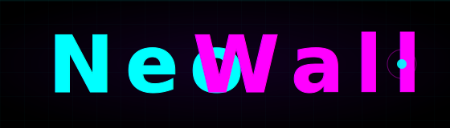

<div align="center">



# NeoWall

**GPU-Accelerated Animated Wallpapers for Wayland**

*Take the red pill. Experience the Matrix. 🔴*

[](LICENSE)
[]()
[]()

[Features](#-features) • [Quick Start](#-quick-start) • [Gallery](#-gallery) • [Commands](#-commands) • [Compositors](#-supported-compositors)

</div>

---

## 🌟 What is NeoWall?

NeoWall brings your desktop to life with **GPU-accelerated animated wallpapers**. Powered by OpenGL ES shaders running directly on your graphics card, it delivers stunning visual effects with minimal CPU usage.

```bash
# One command to enter the Matrix
neowall start
```

Watch as plasma waves, digital rain, fractal noise, and cyberpunk aesthetics flow across your screens—each monitor independently controlled, all fully customizable.

## ✨ Features

### 🎨 **Stunning Visual Effects**
- **30+ Built-in Shaders** - From subtle gradients to trippy fractals
- **Shadertoy Compatible** - Import thousands of community shaders
- **Custom Wallpapers** - Mix static images with shader effects
- **Multi-Monitor Magic** - Different wallpapers on each screen

### ⚡ **Performance First**
- **GPU-Accelerated** - Uses OpenGL ES for hardware rendering
- **Minimal CPU Usage** - ~0.5% CPU on modern hardware
- **Efficient Memory** - <50MB RAM footprint
- **60 FPS Smooth** - Buttery animations at full refresh rate

### 🎮 **Complete Control**
- **CLI Interface** - Control everything from terminal
- **System Tray** - Quick access to all features
- **Per-Monitor Control** - Independent wallpapers for each display
- **Hot Reload** - Change wallpapers without restart

### 🖥️ **Wayland Native**
- Built from the ground up for **modern Linux desktops**
- Works with KDE Plasma, GNOME, Hyprland, Sway, and more
- No X11 baggage—pure Wayland protocol implementation

## 🚀 Quick Start

### Installation

#### From Source
```bash
# Clone the repository
git clone https://github.com/yourusername/neowall.git
cd neowall

# Build and install
meson setup build
meson compile -C build
sudo meson install -C build
```

#### Arch Linux (AUR)
```bash
yay -S neowall-git
```

### First Run

```bash
# Start the daemon
neowall start

# Launch system tray
neowall tray &

# Or control via CLI
neowall next          # Next wallpaper
neowall pause         # Pause cycling
neowall status        # Show current state
```

## 🎯 Commands

NeoWall features a powerful command system with **28 commands** across 6 categories:

### Basic Control
```bash
neowall next              # Switch to next wallpaper
neowall prev              # Previous wallpaper
neowall pause             # Pause automatic cycling
neowall resume            # Resume cycling
neowall status            # Show daemon status
```

### Multi-Monitor Control
```bash
neowall list-outputs                    # List all displays
neowall next-output DP-1                # Next wallpaper on specific monitor
neowall set-output-mode HDMI-1 fill     # Set wallpaper mode (matches config: output.mode)
neowall set-output-duration DP-1 600    # Set cycle duration in seconds (matches config: output.duration)
neowall set-output-path DP-1 ~/pic.jpg  # Set image wallpaper (matches config: output.path)
neowall set-output-shader DP-1 matrix.glsl  # Set shader wallpaper (matches config: output.shader)
```

### Shader Control
```bash
neowall shader-pause      # Pause shader animation
neowall shader-resume     # Resume animation
neowall speed-up          # Faster transitions
neowall speed-down        # Slower transitions
```

### Introspection & Stats
```bash
neowall list-commands              # Show all available commands
neowall command-stats              # View command execution statistics
neowall command-stats next         # Stats for specific command
```

> **💡 Tip:** Run `neowall list-commands --category=output` to see only multi-monitor commands!

## 🎨 Gallery

### Shader Examples

**Plasma Waves** - Hypnotic flowing colors
```bash
neowall set-output-wallpaper DP-1 /usr/share/neowall/shaders/plasma.glsl
```

**Matrix Rain** - Classic cyberpunk aesthetic
```bash
neowall set-output-shader DP-1 /usr/share/neowall/shaders/matrix_rain.glsl
```

**Fractal Noise** - Organic, ever-changing patterns
```bash
neowall set-output-shader DP-1 /usr/share/neowall/shaders/fractal_noise.glsl
```

**Cyberpunk Skyline** - Animated neon city
```bash
neowall set-output-shader DP-1 /usr/share/neowall/shaders/cyberpunk.glsl
```

## 🖥️ Supported Compositors

NeoWall works with all major Wayland compositors:

| Compositor | Support | Layer Shell | Plasma Shell | Notes |
|------------|---------|-------------|--------------|-------|
| **KDE Plasma** | ✅ Full | N/A | ✅ Native | Best experience |
| **Hyprland** | ✅ Full | ✅ Yes | N/A | Excellent performance |
| **Sway** | ✅ Full | ✅ Yes | N/A | Fully tested |
| **GNOME** | ⚠️ Partial | N/A | Limited | Wallpaper mode only |
| **Wayfire** | ✅ Full | ✅ Yes | N/A | Works great |
| **River** | ✅ Full | ✅ Yes | N/A | Supported |

## 📋 Requirements

### Minimum
- **OS:** Linux with Wayland compositor
- **GPU:** Any GPU with OpenGL ES 2.0 support
- **RAM:** 50MB
- **Dependencies:** 
  - `wayland` (≥1.20)
  - `egl` + `glesv2`
  - `libpng`, `libjpeg` (for images)

### Recommended
- **GPU:** OpenGL ES 3.2 capable (for advanced shaders)
- **Compositor:** KDE Plasma, Hyprland, or Sway
- **RAM:** 100MB (for shader compilation cache)

## 🏗️ Architecture

NeoWall is built with modern software engineering practices:

### 🔧 **Modern C11 Design**
- Modular architecture with clean separation of concerns
- Type-safe command registration via macros
- Self-documenting command registry (single source of truth)
- Comprehensive error handling and logging

### 📊 **Built-in Monitoring**
- Detailed execution statistics for all commands
- Performance tracking (min/avg/max execution times)
- Success/failure ratios
- Last error capture for debugging

### 🔌 **IPC Architecture**
- Unix domain sockets for client-daemon communication
- JSON-based protocol for language-agnostic integration
- Async event loop for responsive UI
- Hot reload without daemon restart

### 🎯 **Per-Module Command System**
```
Command Registry (28 commands)
├── Core Commands (registry.c)
│   ├── Wallpaper Control: next, prev, current
│   ├── Cycling: pause, resume, speed-up, speed-down
│   └── Info: status, version, ping, list-commands
├── Output Commands (output_commands.c)
│   └── Multi-monitor: list-outputs, next-output, set-output-*
└── Config Commands (config_commands.c)
    └── Configuration: get-config, list-config-keys
```

## 🛠️ Configuration

Create `~/.config/neowall/config.vibe`:

```yaml
general {
  cycle_interval 300           # Change wallpaper every 5 minutes
  wallpaper_mode fill          # fill, fit, center, stretch, tile
  shader_enabled true          # Enable shader effects
}

paths {
  wallpaper_dir ~/Pictures/Wallpapers
  shader_dir /usr/share/neowall/shaders
}

performance {
  fps_limit 60                 # Max FPS for animations
  vsync true                   # Sync with monitor refresh
}
```

Or use per-output configuration for multi-monitor setups:

```yaml
outputs {
  DP-1 {
    wallpaper_mode fill
    cycle_interval 600
    shader ~/shaders/plasma.glsl
  }
  
  HDMI-1 {
    wallpaper_mode center
    cycle_interval 300
    shader ~/shaders/matrix_rain.glsl
  }
}
```

## 📚 Documentation

- [Build Instructions](BUILD.md) - Detailed compilation guide
- [Command Reference](docs/commands/COMMANDS.md) - All available commands
- [Config-to-Command Mapping](docs/CONFIG_COMMAND_MAPPING.md) - Config keys and their commands
- [Command Registry Architecture](docs/COMMAND_REGISTRY_IMPROVEMENTS.md) - Technical deep-dive
- [Compositor Integration](src/neowalld/compositor/README.md) - How NeoWall works with Wayland

## 🤝 Contributing

We welcome contributions! Whether it's:
- 🎨 New shaders
- 🐛 Bug reports
- ✨ Feature requests
- 📖 Documentation improvements

Check out our [contributing guide](CONTRIBUTING.md) to get started.

## 📜 License

NeoWall is licensed under the **GNU General Public License v3.0**.

See [LICENSE](LICENSE) for details.

## 🙏 Acknowledgments

- **Shadertoy Community** - Inspiration and shader compatibility
- **Wayland Developers** - Modern display protocol
- **OpenGL ES** - Hardware-accelerated rendering
- **The Matrix** - For showing us the way 🔴

---

<div align="center">

**Made with ❤️ for the Linux desktop**

*"Unfortunately, no one can be told what NeoWall is. You have to see it for yourself."*

[⬆ Back to Top](#neowall)

</div>